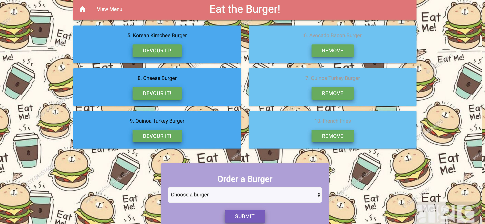
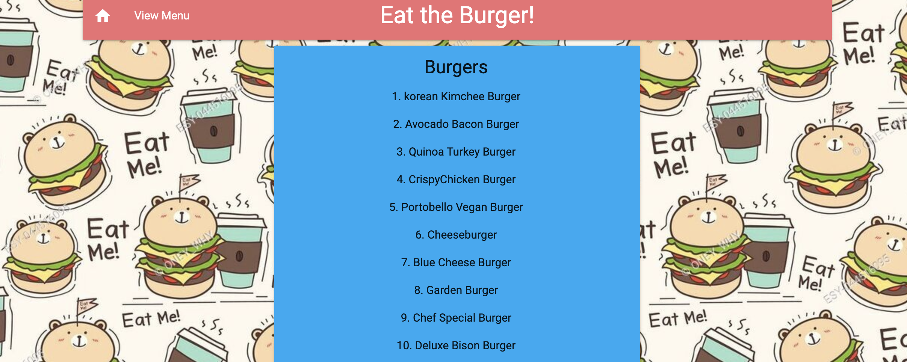

# Eat Da Burger!
In this assignment, you'll create a burger logger with MySQL, Node, Express, Handlebars and a homemade ORM (yum!). Be sure to follow the MVC design pattern; use Node and MySQL to query and route data in your app, and Handlebars to generate your HTML.

# Technologies:
* Node.js
* MySQL
* Handlebars - http://handlebarsjs.com/
* body-parser NPM Package - https://www.npmjs.com/package/inquirer
* express NPM Package - https://www.npmjs.com/package/express
* mysql NPM Package - https://www.npmjs.com/package/mysql
* handlebars NPM Package - https://www.npmjs.com/package/handlebars
* express-handlbars NPM Package - https://www.npmjs.com/package/express-handlebars
# How app should look like:

# Menu page look like:

# GIF of how the app suppose to work:

